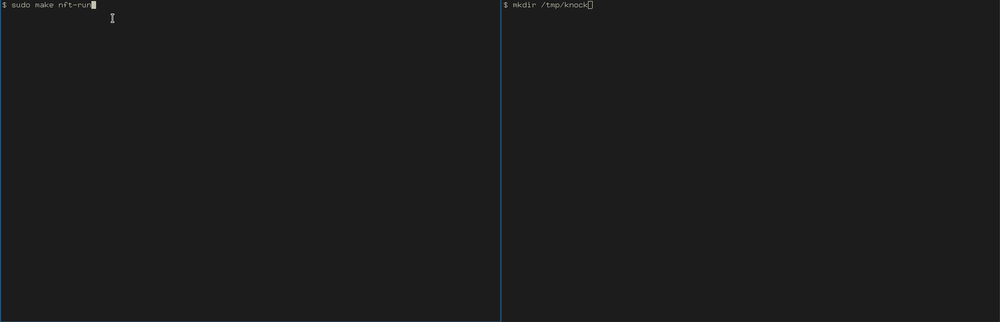

# knockknockgo

Project knockknockgo is a pure Go rewrite of [moxie0's knockknock](https://github.com/moxie0/knockknock) with numerous enhancements.

The logic of knockknockgo is similar to the original knockknock. Some significant changes are:
- supports ChaCha20-Poly1305 or AES-GCM for encryption (defined by user, per port)
- supports both IPv4 and IPv6
- supports nftables and iptables (defined by user)
- no need to have hping installed, uses gopacket to create and send custom packets

Also keep in mind that the original knockknock is unmaintained now for almost 9 years.



## Building

To build this project simply run:
```sh
make
```

This will build two binaries: `kk` and `kkd`. Binaries can be found inside the `bin/` folder after successful build.

## Usage

### Daemon

The "daemon" component `kkd` contains two subcommands: `gen` and `run`. 

#### Generating profiles
Use `kkd gen` to generate profiles for ports, here is the help listing:
```
$ kkd gen -help
Usage of gen:
  -cipher string
    	Specifies cipher algorithm when generating port profile (default "chacha20")
  -connwin uint
    	Specifies number of seconds during which port will be available after successful knock (default 300)
  -port int
    	Specifies profile port when generating profile (default 22)
  -profiles string
    	Location where port profiles are stored (default "/opt/kkgo/profiles")
```

For instance, if you want to generate a profile in `/tmp/profiles/` for port 22 with ChaCha20-Poly1305 cipher and connection window of 100 seconds, you can execute:
```sh
kkd gen -profiles /tmp/profiles -cipher chacha20 -port 22 -connwin 100
```

If you would rather want to use AES-GCM with default connection window, execute:
```sh
kkd gen -profiles /tmp/profiles -cipher aes -port 22
```

### Running watch
Use `kkd run` to start watching logs and verify requests:
```
$ kkd run -help
Usage of run:
  -fw string
    	Firewall type: nftables (nft) or iptables (ipt) (default "nft")
  -kernlog string
    	Location where firewall logs are written (default "/var/log/kern.log")
  -profiles string
    	Location where port profiles are stored (default "/opt/kkgo/profiles")
```

For example, if your profiles are located in `/tmp/profiles` use:
```
kkd run -profiles /tmp/profiles
```

By omitting `-fw` and `-kernlog` parameters, default values will be picked up (nftables firewall with logs written to `/var/log/kern.log`).

**Note that the daemon will not fork.** In order to fork the daemon you can use the `&` sign to send execution to the background, or use `scripts/INSTALL.sh` to install the daemon as a systemd unit.

### Client

The client component `kk` is fairly simple with the following command format similar to `nc`:
```
kk [-profiles PROFILES_DIR] (HOSTNAME|IPV4|IPV6) (PORT)
```

Component usage can be printed with `-help`:
```
$ kk -help
Usage of kk:
  -profiles string
    	Location where profiles are stored (default "/opt/kkgo/profiles")
```

#### Sending knocks

For instance, if you want to send a knock to `localhost` on port `22` with profile located in `/tmp/profiles/` directory, you would execute:
```sh
kk -profiles /tmp/profiles localhost 22
```

The client binary automatically recognizes whether the host parameter is a hostname, IPv4 or IPv6.

## Further reading

### Testing with Docker
You can test the project via Docker container. More information on testing the project with Docker is in the `build/README.md` file.

### Configuration files
Default firewall configurations and systemd unit file is located in the `configs/` directory with a short `README.md` file to use as guide.

### Server install scripts
Simple server systemd unit install and uninstall scripts are located in the `scripts/` directory. Use them for quick server deployments.

### Internals
For more information on the project and implementation of its features, check out the `docs/` directory.
